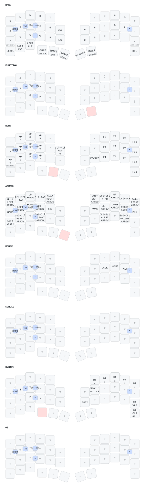

# zmk-config-roBa

図は `config/roBa.keymap` から自動で描いている（main でキーマップ、`config/roBa.json`、`keymap_drawer.config.yaml` のどれかが変わると、`.github/workflows/draw.yml` が描き直してコミットする）。DYA Studio や ZMK Studio で本体に保存した変更（実行時設定）と、エンコーダの割り当ては図に出ない。
